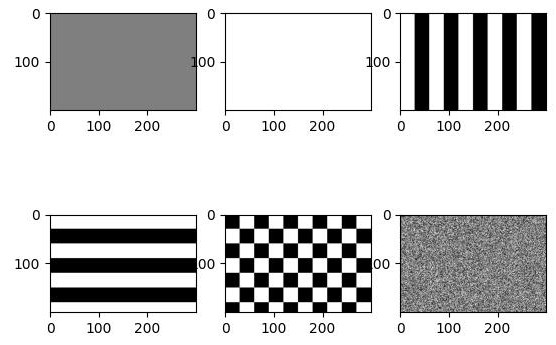

# Tarefas

## Sobre as tarefas (vale para todas as tarefas)

- Enviar a resolução via tarefa do SIGAA
    - Deve conter os códigos-fonte e imagens utilizadas (ex.: .py, .cpp, .jpg)
    - Se for colab ou similar, enviar arquivo .ipynb (não esquecer das imagens)
- Apresentar ao professor até o prazo definido
    - O professor poderá fazer perguntas conceituais e relativas à implementação, assim como solicitar modificações específicas no código para fins de avaliação
- Pode utilizar a linguagem que desejar (recomendo python/c/c++)
- Deve utilizar a biblioteca OpenCV

## Sobre o uso de IA

P: posso utilizar IA?
R: sim, desde que seja para auxiliar a aprendizagem em visão computacional e não para substituir a sua parte ativa neste processo. Espera-se, por exemplo, que para um dado problema em visão computacional saiba, sem auxílio da IA, explicar os **conceitos envolvidos** e a **lógica computacional** para resolvê-lo. A linguagem e a biblioteca são o meio, enquanto que entender os fundamentos e a lógica computacional são o fim.

Pode utilizar IA para:

- compreender conceitos
- aprender sintaxe/uso da biblioteca
- auxiliar na depuração de códigos

Não para:

- delegar a resolução da tarefa (incluindo partes)

# Tarefa 1

## Especificação da tarefa

- Pontuação: 0.6pts
- Em grupo de até 3 alunos
- Prazo: 26/08 23h59
- Apresentação: até dia 27/08

---

### Tarefa 1A

- o programa deve exibir as seguintes 6 imagens (em 2 linhas e 3 colunas) de tamanho $280 \times 200$ (280 colunas, 200 linhas):
	- imagem repleta de cinza (intensidade 127), imagem repleta de branco (intensidade 255)
	- listras verticais com largura 30, listras horizontais com altura 30
	- padrão xadrez com casas de lado 30
	- imagem com intensidades aleatórias entre 0 e 255
	
	{width=50%}

---

### Tarefa 1B

- o programa deve exibir na tela as 4 imagens de patch01.jpg a patch04.jpg, um do lado do outro
	- talvez precise utilize cv2.cvtColor para transformar de BGR (ordem dos componentes de cor que o opencv utiliza) para RGB (ordem usual e que o matplotlib utiliza)

\centering
{width=10%}
{width=10%}
{width=10%}
{width=10%}

---

### Tarefa 1C

- o programa deve exibir duas imagens: (1) imagem da webcam e (2) o filtro de canny aplicado na primeira imagem (pesquise como utilizar cv2.canny), usando dois inteiros como limiares nos argumentos do filtro.

- os dois inteiros devem ser parâmetros do seu programa
    - inclua se quiser controles via interface gráfica
- utilize uma imagem fixa enquanto não conseguir uma webcam
- obs.: por enquanto não precisa compreender o filtro de canny, apenas utilize-o

